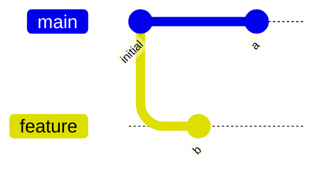
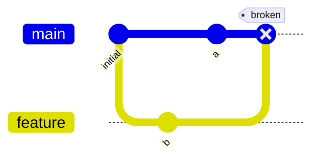
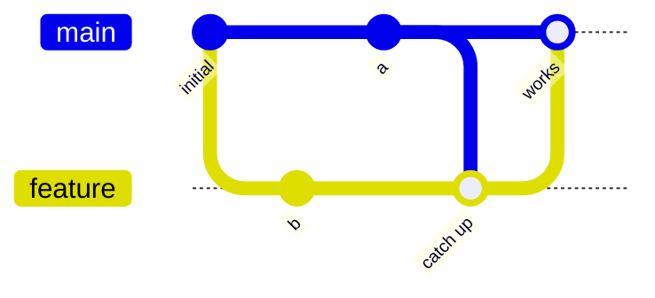
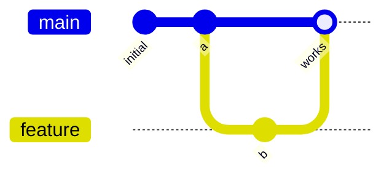

# example

An example of how not having a PR branch up to date with main can cause bugs even without conflicts.

The package just concatenates strings. 

After the first commit, the developers realize it might not be good to always print the input strings.

so one developer just goes ahead and smashes a fix to main that parameterizes the existing "combine" function.

the other removes the param to the "combine" function.

both of them work independently, and there are no conflicts. the PR checks are green, and so are the checks in main. however if the PR were to merge, then main() would fail because it tries to pass a parameter to `combine_strings` that no longer exists.

the only way to prevent this kind of bug is to make sure that PR branches are always up to date before they are merged - this shouldn't be controversial! That requirement is literally "when I am making changes to the code, the changes that I am making also work with the current state of the branch i am merging them into."

Or, graphically:

if you are in a state where commits "a" and "b" here are *logically incompatible* but do not have *conflicts in the lines that were changed*:

then you *can't* just do this:

instead you need to either merge main into the feature branch first

or you need to rebase the feature branch off main

